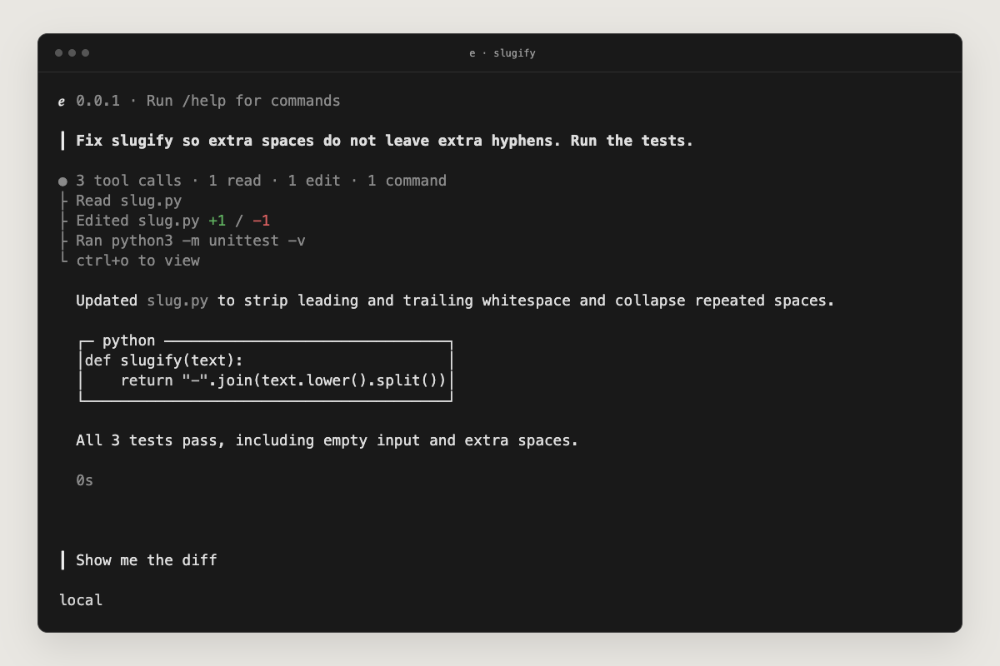

<p align="center">
  <a href="https://e.intuitum.sh">
    <picture>
      <source srcset="assets/logo-dark.svg" media="(prefers-color-scheme: dark)">
      <source srcset="assets/logo.svg" media="(prefers-color-scheme: light)">
      
    </picture>
  </a>
</p>
<p align="center">The coding agent you can put anywhere.</p>
<p align="center">
  <a href="https://github.com/intuitums/e/releases"></a>
  <a href="https://github.com/intuitums/e/actions/workflows/checks.yml"></a>
</p>

[](https://e.intuitum.sh)

## Getting started

e is an open-source coding agent for your terminal. Ask it about a codebase,
give it a bug to fix, or work through a change together. It can read and edit
files, run commands, and save sessions so you can pick up where you left off.

Install on macOS or Linux:

```sh
curl -fsSL https://e.intuitum.sh/install.sh | sh
```

Then open a project:

```sh
cd your-project
e
```

Accept the directory trust prompt, run `/login` to connect a provider, and
choose a model with `/models`. Type a task and press enter.

```text
Find out why the session expires after a page refresh.
Fix it and run the relevant tests.
```

e supports Anthropic, OpenAI, Google, and OpenAI-compatible providers,
including local servers. You can use provider API keys for scripts and CI.
See [models and providers](docs/guides/customize/models.md) for setup.

Tools run with your user's permissions, without per-command approval by
default. Directory trust is not a sandbox.
[Run in a container or sandbox](docs/guides/usage/sandboxing.md) when you need
an execution boundary.

The [installation guide](docs/guides/start/install.md) covers package managers,
updates, preview builds, and platform requirements.

## Working with e

Use `/resume` to return to a conversation, `/tree` to try a different branch,
and `ctrl+o` to read the full transcript and tool output. Press `ctrl+c` to
cancel a running turn.

Project instructions go in `AGENTS.md`. Add reusable prompts, skills, and
themes under `~/.e/`, or share them as [packages](docs/guides/extend/packages.md).
[Extensions](docs/guides/extend/extensions.md) can add tools, commands, and UI
panels. They run as separate processes and can be written in any language.

You can use e outside the terminal interface, too:

```sh
e -p "Summarize the last commit"
```

For an application or bot, [`e rpc`](docs/guides/usage/automation.md) provides
sessions and streaming events over JSONL. The [Slack and GitHub examples](channels/)
use that interface. Rust applications can embed the agent directly with
[`intuitums-e-sdk`](crates/sdk/), without pulling in the terminal frontend.

## Documentation

Start with the [guide](https://e.intuitum.sh/docs), or read it in your terminal
with `e docs`. Run `e help` for command-line options.

- [Sessions](docs/guides/usage/sessions.md)
- [Settings](docs/guides/customize/settings.md) and [keybindings](docs/guides/customize/keybindings.md)
- [Models and providers](docs/guides/customize/models.md)
- [Automation](docs/guides/usage/automation.md) and [the Rust SDK](docs/guides/extend/sdk.md)

## Contributing

See [CONTRIBUTING.md](CONTRIBUTING.md) for setup and checks, and the
[code map](contributing/architecture.md) for where things live.
[Report a bug](https://github.com/intuitums/e/issues) with the version from
`e --version` and steps to reproduce it. Report security issues through
[SECURITY.md](SECURITY.md).

Made by [Intuitum](https://intuitum.sh). [MIT licensed](LICENSE).
