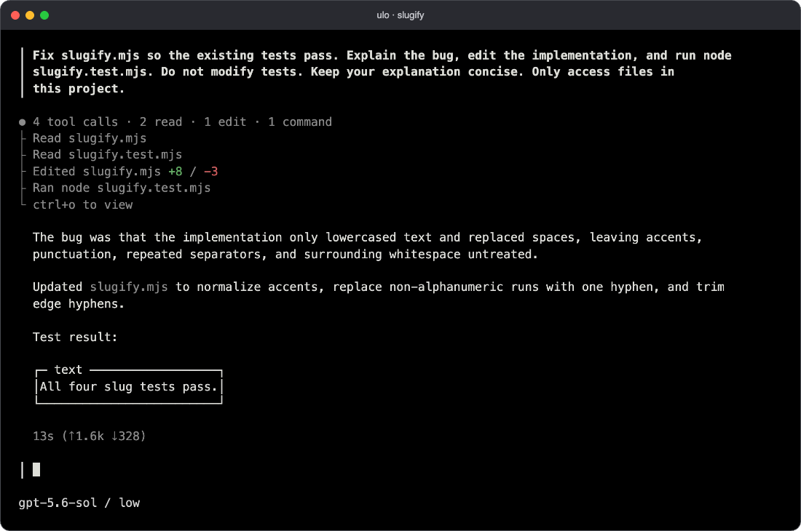

<p align="center">
  <a href="https://aro.computer/e">
    <picture>
      <source srcset="assets/logo-dark.svg" media="(prefers-color-scheme: dark)">
      <source srcset="assets/logo.svg" media="(prefers-color-scheme: light)">
      
    </picture>
  </a>
</p>
<p align="center">The coding agent you can put anywhere.</p>
<p align="center">
  <a href="https://github.com/arocomputer/e/releases"></a>
  <a href="https://github.com/arocomputer/e/actions/workflows/checks.yml"></a>
</p>

[](https://aro.computer/e)

---

### Installation

e is in development. Public releases and package-manager distributions are
paused. Build and run this checkout with the Rust toolchain:

```sh
git clone https://github.com/arocomputer/e.git
cd e
./x dev /path/to/project
```

[Installation guide](docs/guides/start/install.md)

### Usage

```sh
cd your-project
e
```

Run `/login` to connect a provider, then `/models` to choose a model.

### Documentation

Read the [docs](https://aro.computer/e/docs), or run `e docs` in your terminal.

### Contributing

See [CONTRIBUTING.md](CONTRIBUTING.md) to get started.

---

<p align="center">
  <a href="https://aro.computer">ARO</a> · <a href="LICENSE">MIT</a>
</p>
